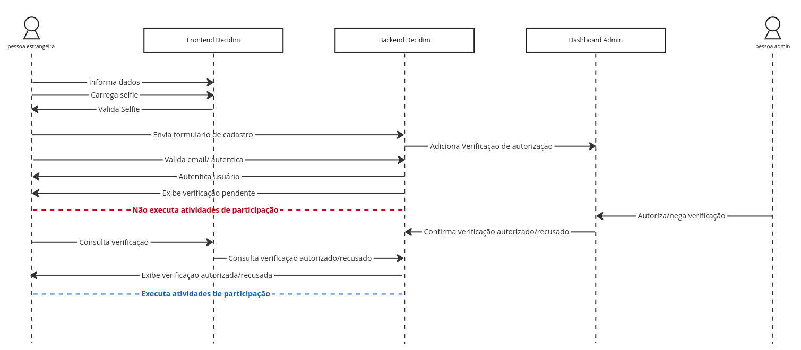
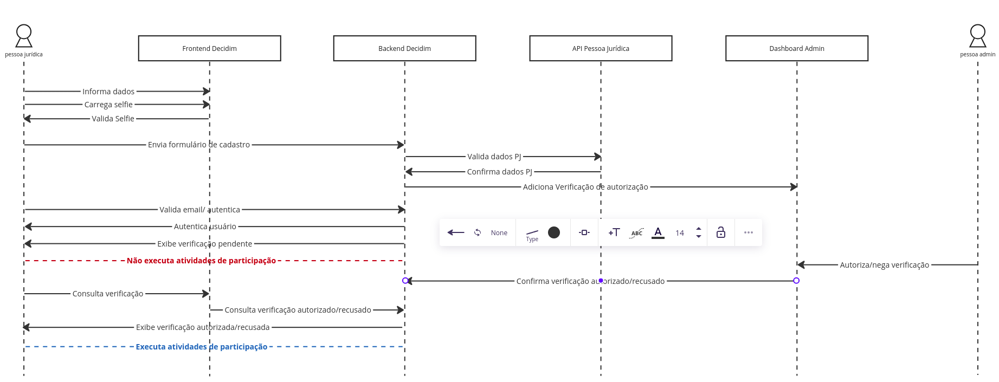

A conclusão desta análise pretende responder à questão

    Como podemos implementar a solução, levando em consideração o contexto da plataforma, recursos e limitações?

Tendo em vista as dificuldades impostas pelo projeto com relação a acesso a dados e servidores de produção, bem como àquelas relacionadas aos processos naturalmente burocráticos do governo, a solução mais adequada ao momento atual do **Brasil Participativo** e com menor impacto/risco para produção é a incorporação dos fluxos de autenticação alternativos como **módulos Rails adicionados ao Decidim**.

## Uso do Decidim/Devise

Considerando as alternativas identificadas (Keycloak ou Devise), o uso dos recursos do próprio Decidim, por meio do Devise, se apresentaram como mais adequada à implementação. Ainda existem questões a serem respondidas a respeito de validações específicas como quais dados de pessoas jurídicas serão consultados, ou ainda, em que momento do processo de registro do usuário será feita a validação dos documentos oficiais.

Entretanto, dadas as características do Keycloak, implementar tais validações sem os recursos de verifications, Authorizations e User Register Modes oferecidos pelo Decidim ([veja aqui](devise.md)) seria um processo mais demorado e passível de falha. Além de representar um custo permantente de manutenção de infraestrutura e gestão administrativa sem gerar grandes benefícios diretos.

## Proposta

A estrutura proposta para a autenticação secundária do Brasil Participativo envolve 2 módulos distintos. Um primeiro para a inclusão do novo fluxo utilizando a API de Authorizations, que irá fazer a validação dos dados enviados em dois formatos:

    1. Via API do SISP e foto de documento oficial, no caso de dados de pessoas jurídicas
    2. Via foto de documento oficial moderado por um administrador, no caso de pessas estrangeiras.

Para evitar possíveis vulnerabilidades de DoS com submissão de arquivos em massa e caso o volume de cadastros de pessoas estrangeiras cresça substancialmente, será incluída uma validação adicional por detecção de imagem no frontend, que indique se os arquivos enviados são válidos ou se não puderam ser avaliados. Os documentos considerados fraudulentos ou incorretos não poderão ser submetidos à plataforma. Esses arquivos podem ser imagens sem nenhum rosto detectado ou que não contenham dois rostos semelhantes ou ainda, que tenham qualidade muito baixa.

O segundo módulo irá adicionar novos atributos ao perfil de usuário, como Número de inscrição no CPF, endereço de e-mail, número de telefone, número de inscrição do trabalhador (NIS), municipío, unidade da Federação e região de residência, data de nascimento, Sexo, raça/cor, deficiência, profissão, grau de instrução, beneficiário do Bolsa Família, situação domiciliar, função principal de trabalho, grupos populacionais tradicionais e específicos, família quilombola, residência em reserva indígena e renda. Irá também definir os campos adicionais ao cadastro, caso necessário, além de possibilitar a alteração dos campos na edição do perfil. O total de campos novos adicionados irá depender do formato de enriquecimento da base definido.

## Diagramas demonstrativos

Os diagramas a seguir ilustram como o fluxo deverá feito acontecer. O primeiro apresenta o fluxo de comunicação para usuários estrangeiros, que irá depender de moderação do administrador para autorizar a foto do documento enviada. Perceba que terá uma validação do arquivo de imagem no frontend para que o usuário envie imagem adequada para verificação do moderador.

Já o fluxo para pessoa jurídica terá um passo adicional executado no momento da submissão do formulário que irá consultar a API oficial de dados PJ do governo federal e, caso as informações estejam corretas, irá submeter os dados para o administrador validar.

A validação de selfie com documento oficial também será necessária para o cadastro de Pessoa Jurídica para evitar que pessoas com dados de terceiros consigam cadastrar instituições. Como a prestação de contas de muitas organizações sem fins lucrativos são abertas e estão disponíveis *online*, permitir o cadastro sem a autorização da pessoa administradora do CNPJ pode ser uma falha de segurança.

