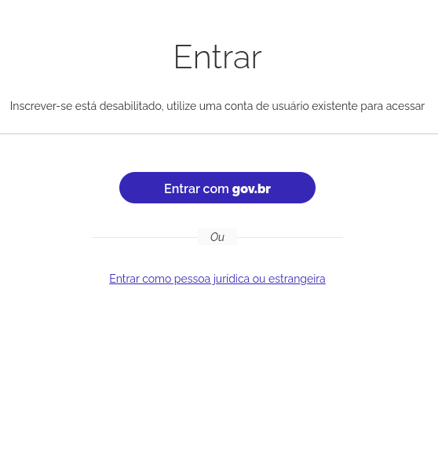
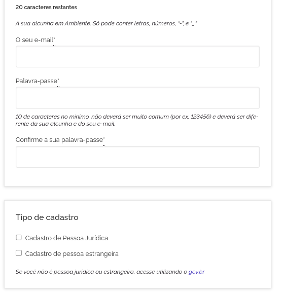
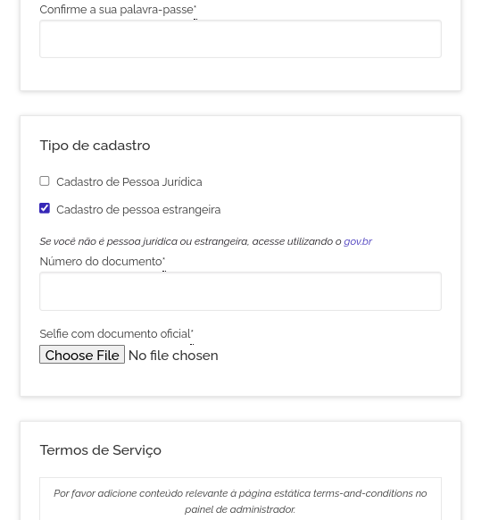
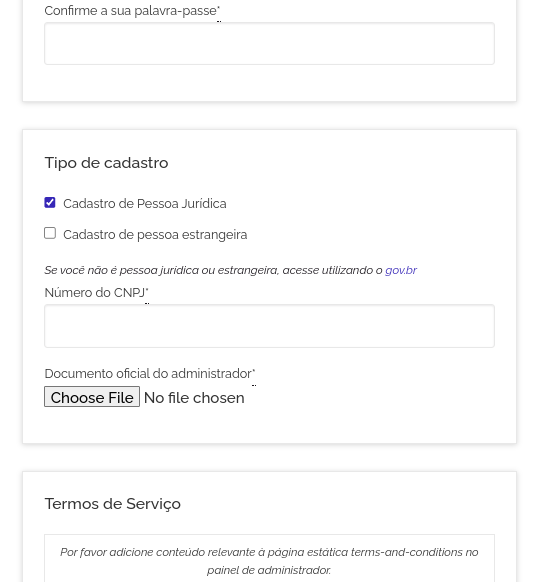

## Introdução

Este repositório contém os estudos feitos sobre as ferramentas de autenticação e registro de usuários disponíveis no ecossistema Decidim, mais especificamente sobre [Keycloak](https://www.keycloak.org/) e [Devise](https://github.com/heartcombo/devise), como alternativas viáveis para uso no **Brasil Participativo**. Foram levados em consideração e avaliados também os demais [módulos de autenticação](https://decidim.org/modules/#auth) da comunidade e possíveis aplicabilidades ao cenário de uso da plataforma.

Foram levantadas as características e requisitos principais da solução e quais cenários de uso precisam contemplar para atender às necessidades de negócio, para então avaliar características técnicas e o impacto geral das soluções para a plataforma. Na seção sobre a [estrutura](#estrutura) é possível acessar os conteúdos específicos que foram avaliados.

## Requisitos gerais

Para o desenvolvimento de autenticação alternativa ao gov.br, é necessário primeiro que exista a premissa do **gov.br como primeira alternativa de autenticação**. A ferramenta proposta precisa ser secundária e, consequentemente, mais complexa ou burocrática para que não se torne a principal forma de autenticação.

A necessidade de um segundo mecanismo de registro/login se dá para os casos que não são cobertos pelo gov.br, como:

  1. Autenticação de pessoas estrangeiras
  2. Autenticação de pessoas jurídicas

A autenticação de pessoas estrangeiras é uma garantia legal e precisa ser disponibilizado para que o Brasil Participativo consiga substituir plenamente a plataforma participa + Brasil. A autenticação deverá ser feita de forma a garantir a pessoalidade do acesso e critérios de segurança, como autenticação em dois fatores ou pelo reconhecimento de documentação oficial (selfie com passaporte, por exemplo).

Já para pessoas jurídicas, a autenticação precisa garantir a unicidade e veracidade dos dados fornecidos. Nesse sentido, foram avaliadas APIs públicas e governamentais de consulta de dados da receita para validação das informações com a finalidade última de evitar perfis falsos e robôs. Nessa avaliação, inclímos as bases do SISP que a presidência já possui acesso.

Além das questões que dizem respeito exclusivamente aos dados de acesso à plataforma, foi necessário incorporar na pesquisa, soluções que possibilitem o enriquecimento da base, para que o cidadão possa informar dados. Esse fluxo precisa ser possibilitado fora do registro, porém serão dados incorporados ao Perfil e deverão ser confgurados como uma extensão do Decidim. Uma solução semelhante seria o módulo [extra_user_fields](https://github.com/PopulateTools/decidim-module-extra_user_fields).

Simplificando, temos os seguintes requisitos:

{==

=== "1. Autenticação"
    ### Autenticação 
    **Autenticação de pessoas jurídicas e estrangeiras.**
   
    A autenticação de pessoas jurídicas e estrangeiras é **obirgatória**. É necessário que o sistema garanta a confiabilidade dos cadastros. O que traz mais dois requisitos obrigatórios: A validação dos dados de Pessoa Jurídica e a moderação dos cadastros de estrangeiros.
    O formulário de cadastro padrão do **Brasil Participativo** deve incluir uma nova seção para seleção do tipo de cadastro, se pessoa jurídica ou estrangeira. Como ilustra a imagem abaixo.
    
    {: style="width:calc(25% - 8px)"}
    {: style="width:calc(25% - 8px)"}
    {: style="width:calc(25% - 8px)"}
    {: style="width:calc(25% - 8px)"}

    As imagens apresentam uma alternativa visual do que deve ser adicionado ao sistema para se conseguir executar o processo de autenticação. É importante ressaltar que após a seleção do checkbox, seria necessário pensar o fluxo específico de cada tipo de usuário.

=== "2. APIs oficiais"
    ### APIs oficiais 
    **Cruzamento de dados de pessoas jurídicas com APIs oficiais SISP.**

    !!! tip inline end "Observação"
        É necessário definir o processo de validação dos campos e a incorporação de atributos obrigatórios para que as validações possam ser executadas.
    
    A consulta da [API de acesso aos dados de Pessoas Jurídicas do SISP](https://www.gov.br/conecta/catalogo/apis/consulta-cnpj) deverá ser consultada no momento do processamento da submissão do formulário de cadastro. Nesse caso, a API de Verifications deverá ser expandida para incluir uma verificação nova que fará a validação da conta. Dessa forma, será possível cadastrar a conta e acessar as consultas e demais áreas da plataforma, porém não será possível participar ativamente do processo. 

=== "3. Documento oficial"
    ### Documento oficial  
    **Validação de dados de pessoas estrangeiras por meio de moderação**

    !!! tip inline end "Observação"
        O primeiro passo do processo é avaliar a necessidade de se incorporar o fluxo de Verifications ao formulário de cadastro, caso a estrutura de permissões não seja suficiente para evitar a participação dos novos usuários sem a devida validação das contas.
    
    A validação de contas cadastradas como pessoas estrageiras é **obrigatória** e será feita utilizando o fluxo de validação de [Identity Documents](https://docs.decidim.org/en/develop/admin/participants/authorizations/identity_documents.html) já existente na plataforma. Caso seja necessário incorporar a validação de documentos no formulário de cadastro, será incorporada ao formulário uma validação da imagem enviada para evitar envios em massa de arquivos no cadastro, o que seria uma falha para ataques de Deny of Service (DoS/DDoS).

    Para fazer essa validação, sugerimos a inclusão de uma [biblioteca aberta de detecção facial](https://github.com/justadudewhohacks/face-api.js) para identificar se o documento enviado apresenta de fato o rosto do usuário e um documento com rosto equivalente. O procedimento seria feito diretamente no front com o objetivo de evitar um fluxo grande de submissões.

=== "4. Novos atributos"
    ### Novos atributos 
    **Inclusão de dados adicionais aos perfis de usuário**

    !!! danger inline end "Atenção"
        A definição da inclusão dos dados para enriquecimento da base como parte do Decidim ou não é crítica para a implementação desse recurso.

    A inclusão de novos campos como: número de telefone, número de inscrição do trabalhador (NIS), municipío, unidade da Federação e região de residência, data de nascimento, sexo legal, raça/cor, deficiência, profissão, grau de instrução, se é beneficiário do Bolsa Família, situação domiciliar, função principal de trabalho, grupos populacionais tradicionais e específicos, família quilombola, residência em reserva indígena e renda.

=== "5. Enriquecimento"
    ### Enriquecimento 
    **Cruzamento de dados com APIs de CPF/CNPJ para enriquecimento da base**

    !!! danger inline end "Atenção"
        A definição da inclusão dos dados para enriquecimento da base como parte do Decidim ou não é crítica para a implementação desse recurso.

    Os dados de consultados por meio das APIs do SISP podem ser utilizados para enriquecimento da base de usuários. Além disso, podem ser incluídos na plataforma a solicitação de dados aos uusuários sempre que estes não puderem ser obtidos de forma automatizada. É necessário porém definir qual a estratégia de enriquecimento da base, se diretamente pelo pipeline de dados externo ao Rails ou se por meio de fluxos alternativos de solicitação ao usuário autenticado.

==}

É importante ter em mente esses itens porque foram utilizados como base para a avaliação das tecnologias e vão aparecer em vários outros pontos dessa análise como forma de garantir que sejam de fato levados em consideração nos estudos. Eles são críticos na formatação das soluções e na definição das estratégias de implementação da autenticação secundária.

## Estrutura

A análise foi dividida em 4 tópicos principais: 

1. **[Avaliação curta dos módulos do Decidim:](modulos.md)** elencar soluções que podem ser utilizados no contexto da plataforma Brasil Participativo para autenticação e cadastro de usuários e compreender os porquês da seleção de Keycloack e Devise.
2. **[Avaliação mais detalhada do Keycloak:](keycloak.md)** contextos e aplicabilidades da plataforma da solução e os implicações do uso do Keycloak para autenticação na plataforma.
3. **[Avaliação do uso do Devise/Rails:](devise.md)** análise do uso da estrutura de autenticação do próprio Decidim (que utiliza o Devise) e avaliação da incorporação de novos atributos ao perfil do usuário.
4. **[Definições alcançadas:](conclusoes.md)** Resultados alcançados com o estudo e definições dos requisitos técnicos e de negócio pensados para a solução proposta.

## Resultados

Era esperado que este levantamento respondesse três questões principais:

    1. Quais os requisitos principais da solução secundária de autenticação?
    2. Quais as alternativas que o Decidim disponibiliza para atendermos aos requisitos?
    3. Como podemos implementar a solução, levando em consideração o contexto da plataforma?
    
O primeiro ponto foi respondido por meio de reuniões e encontros com membros-chave do projeto e foi documentado neste trabalho a fim de guiar 
a análise dos módulos e recursos do Decidim e das capacidades da plataforma de atender aos requisitos principais.

O Para o segundo item, é descrita a análise dos módulos e ferramentas que podem ser de interesse para a solução e feito um detalhamento das alternativas
tecnicamente viáveis para a implementação. Duas alternativas foram encontradas e avaliadas, o Keycloak como solução externa de autenticação e gestão de
usuários e o próprio Decidim, utilizando os recursos do Devise e APIs disponibilizadas pela aplicação.

O terceiro item é apresentado na última página de [conclusões](conclusoes.md), que descreve com mais detalhes a proposta de solução e a arquitetura para desenvolvimento.
