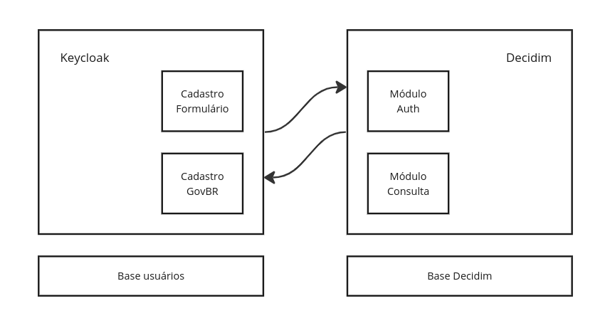

???+ abstract "Resumo da análise"

    O Keycloak é uma plataforma de federação de usuários para autenticação segura, gestão de usuários e de permissões. Os principais casos de uso da solução são:
    
    1. Aplicações multiplas com autenticação centralizada
    2. Integração com base de usuários LDAP ou AD
    3. Gestão de multiplos formatos de autenticação (social, oauth, OpenID ou via formulário)
    
    O **Brasil participativo** não se enquadra em nenhum dos casos. Porém, como já existe um plugin de autenticação dosponível, foi avaliado o cenário de adoção
    da solução, foram identificados outros pontos de atenção que apontam contra a adoção do Keycloak, sendo eles:

    1. Necessidade de migração da autenticação via Govbr para o Keycloak
    2. Construção dos mecanismos de verificação da autenticação secundária fora do Decidim
    3. Implementação de módulos Decidim customizados para consulta de dados e permissões
    4. Incorporação do Keycloak como serviço adicional na infraestrutura atual da plataforma

    Por esses pontos, **o Keycloak se apresenta como uma alternativa possível, porém mais complexa e cara, do ponto de vista financeiro e de tempo, para implementação**. Além de adicionar custos de manutenção permanentes ao Brasil Participativo.

## O que é e como funciona

O Keycloak é uma plataforma de federação de usuários, para autenticação segura, gestão de usuários e de permissões. A plataforma disponibiliza recursos para a centralização completa da gestão de usuários e sessões, como Single-Sign On, Login Social e serviços de autorização.

Os casos de uso descritos na documentação do Keycloak, indicam o uso da plataforma principalmente para a autenticação centralizada de multiplas aplicações e integração com bases externas como LDAP ou Microsoft AD. Dessa forma, o principal valor entregue pelo Keycloak é o gerenciamento dos dados, sessões e permissões de usuário em uma única base, integrada nas aplicações por meio de consultas via API e protocolos padronizados de autenticação.

## Cenário Brasil Participativo

Para o caso do **Brasil Participativo**, a plataforma será utilizada para disponibilizar recursos de autenticação, tanto para consulta de permissões quanto para consulta de dados dos perfis de usuários. Por ser uma plataforma que centraliza os perfis de usuários, seria recomendado **migrar a estrutura de autenticação do GovBR para o Keycloak** como um realm customizado, ou seja, todo o fluxo de cadastro e autenticação de usuários deve feito no Keycloak, para que ele possa entregar o valor a que se propõe.

Um ponto importante é que o Brasil Participativo possui uma única aplicação rails para autenticação. O Keycloak pode ser uma ferramenta complexa demais para se prover dados de usuários para apenas uma aplicação, dado que a plataforma é recomendada para gerenciar autenticação centralizada para multiplas aplicações. Caso fosse de interesse do Brasil Participativo, desenvolver aplicativos ou outros portais com autenticação centralizada, o Keycloak seria uma melhor solução.

Um outro aspecto levantado é que a utilização do Keycloak requer um trabalho adicional de configuração e gestão de infraestrutura específica para essa solução. Será necessário configurar servidores Keycloak para ambientes de desenvolvimento, homologação e produção independentes e é necessário considerar a manutenção futura dessas aplicações.

## Como pode ser implementado

Para a análise, utilizou-se um servidor do Keycloak localmente e configurou-se o módulo de autenticação no Decidim para identificar as necessidades de mudanças no fluxo atual. A gestão de dados dos usuários autenticados via Keycloak é gerida fora do Decidim e não possui os mesmos recursos de acesso dos usuários cadastrados via govbr, dado que as informações do usuário estão de fato registradas em outra aplicação.

O Keycloak pode fornecer mais dados na autenticação, porém cada ponto de acesso a dados precisará validar a origem do usuário, se rails ou keycloak, para consultar os dados corretos. Ou então será necessária a migração da autenticação via GovBR como um realm independente no Keycloak e todos os usuários fariam o login via Keycloak. Esta última seria a solução mais robusta, centralizando os dados de usuários no Keycloak.

A estrutura simplificada apresenta 4 caixas, duas seriam implementadas/inplantadas como módulos rails para integração com o Keycloak e duas seriam realms/customizações no Keycloak. O login com o GovBr seria migrado e o forumlário de cadastro implementado diretamente no Keycloak. Já o Decidim irá incorporar o módulo da comunidade de autenticação com o Keycloak e implementar um novo módulo para fazer a atualização e consulta de dados dos perfis de usuários, para atender ao requisito 4 (inclusão de dados adicionais ao perfil do usuário).

O cruzamento de dados com APIs e as validações de documentos teriam que ser desenvolvidos do zero dentro do realm do Keycloak. No caso da implementação utilizando o [próprio Devise](devise.md), seria possível utilizar recursos do Decidim como [Authorizations](https://docs.decidim.org/en/v0.27/customize/authorizations) e [Verifications](https://andreslucena.gitbooks.io/docs-developers/content/modules/official/verifications.html) para simplificar e agilizar o desenvolvimento dos recursos de confiabilidade, mais especificamente os requisitos 2 e 3 identificados.
