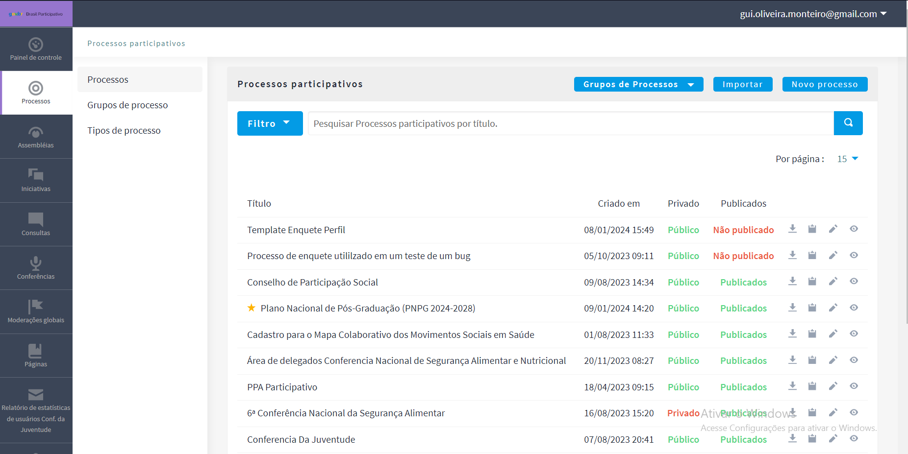
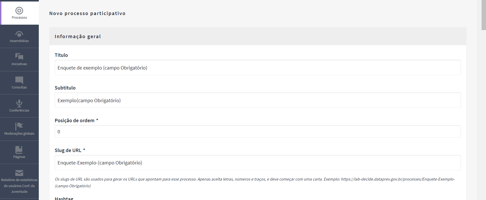
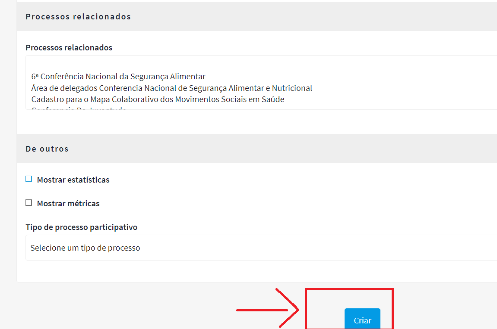
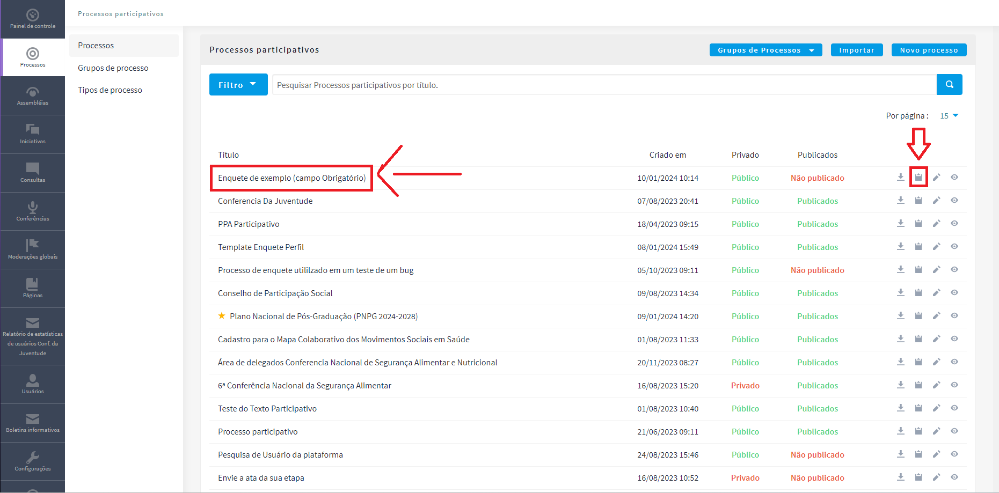
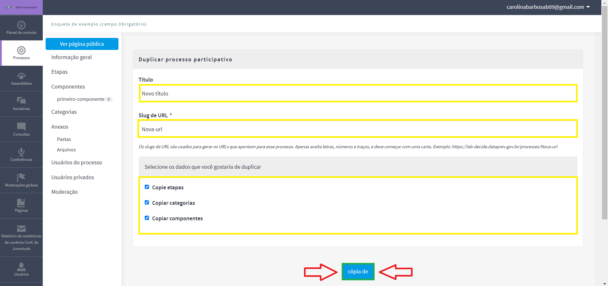

# Questionário Perfil

## Jornada da Presidência 

### Introdução

&emsp;&emsp;O presente documento tem como objetivo explicar como criar um template de uma enquete no módulo "Processos". Além de fornecer um tutorial, demonstrando desde sua criação até seu resultado final.

### Entendendo a interface

&emsp;&emsp; A tela inicial de quando se está dentro de Processos do painel de administração do Brasil Partcipativo está representado pela Imagem 01, e a tela que será exibida ao selecionar "Novo Processo" está representada pela Imagem 02.

<figure markdown>
 
</figure>

<h6 align = "center">Imagem 01: (Fonte: DECIDIM 2024)

<figure markdown>
 
</figure>

<h6 align = "center">Imagem 02: (Fonte: DECIDIM 2024)

</h6>

&emsp;&emsp; Já dentro do espaço do Novo Processo Participativo, indique um título, um subtítulo e um nome para a URL, pois são campos obrigatórios.

&emsp;&emsp; Ao selecionar "criar", representada pela Imagem 04, você cria um novo processo.  

<figure markdown>
 
</figure>

<h6 align = "center">Imagem 03: (Fonte: DECIDIM 2024)

</h6>

### Duplicando o template de audiência pública

&emsp;&emsp; Voltando a tela inicial mas dessa vez representada pela Imagem 04, é possivél encontrar o template de audiência pública marcado de amarelo e para duplicar o template, o  botão está direcionado por uma seta vermelha.

  

<figure markdown>
 
</figure>

<h6 align = "center">Imagem 04: (Fonte: DECIDIM 2024)

</h6>

Após selecionar a opção de duplicar presente na Imagem 04, o administrador é direcionado para a tela representada pela Imagem 05.

Onde para duplicar o processo é necessário alterar o Título, a Url e selecionar o campos com os dados que deseja copiar.

<figure markdown>
 
</figure>

<h6 align = "center">Imagem 05 (Fonte: DECIDIM 2024)

</h6>

### Adicionando um administrador ao Questionário Perfil

&emsp;&emsp; Assim como uma consulta pública, o questionário perfil também é um processo participativo, por isso será mostrado um exemplo de como adicionar um admin numa consulta pública conforme as imagens a seguir, para que possa ser replicado em questionário perfil.

  

Como mostra na Imagem 06, basta entrar no espaço "Usuários do processo" e selecionar o botão "Novo usuário do processo" marcado de laranja.

<figure markdown>
 
</figure>

<h6 align = "center">Imagem 06 (Fonte: DECIDIM 2024)

</h6>

E terá os campos "Nome", "Email" e "Cargo" disponíveis para ser preenchidos como na Imagem 07.

<figure markdown>
 
</figure>

<h6 align = "center">Imagem 07 (Fonte: DECIDIM 2024)

</h6>

Na Imagem 08, conseguimos ver exemplificado como devem ser preenchidos esses campos e logo em seguida na Imagem 09 podemos ver a confirmação do novo admistrador do processo.

<figure markdown>
 
</figure>

<h6 align = "center">Imagem 08 (Fonte: DECIDIM 2024)

</h6>

<figure markdown>
 
</figure>

<h6 align = "center">Imagem 09 (Fonte: DECIDIM 2024)

</h6>

Também tem outro meio de confirmação, o novo administrador recebe um email informando que foi atribuído o cargo administrador dentro da consulta pública para ele assim como está exemplificado na Imagem 10. 

<figure markdown>
 
</figure>

<h6 align = "center">Imagem 10 (Fonte: DECIDIM 2024)

</h6>
