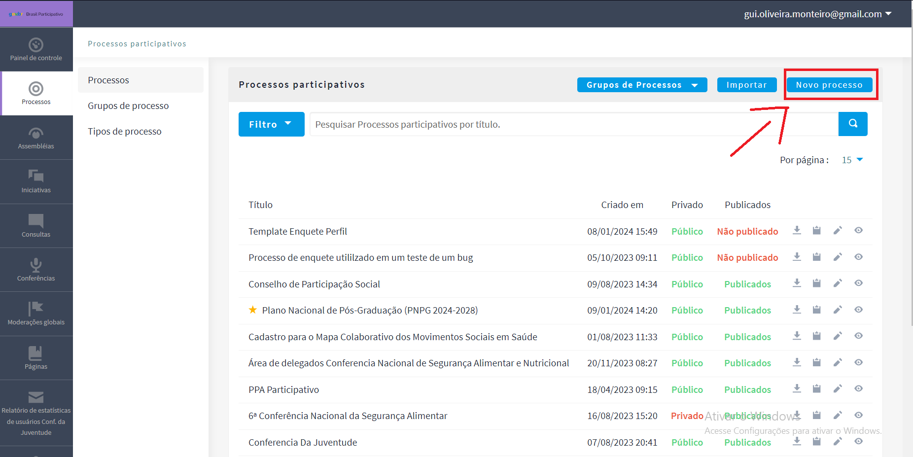

# Questionário Perfil

## Introdução

&emsp;&emsp;O presente documento tem como objetivo explicar como criar um template de uma enquete no módulo "Processos". Além de fornecer um tutorial, demonstrando desde sua criação até seu resultado final.

## Entendendo a interface

&emsp;&emsp; A tela inicial de quando se está dentro de Processos do painel de administração do Brasil Partcipativo está representado pela Imagem 01, e a tela que será exibida ao selecionar "Novo Processo" está representada pela Imagem 02.

<figure markdown>
 
</figure>

<h6 align = "center">Imagem 01: (Fonte: DECIDIM 2024)

<figure markdown>
 
</figure>

<h6 align = "center">Imagem 02: (Fonte: DECIDIM 2024)

</h6>

&emsp;&emsp; Já dentro do espaço do Novo Processo Participativo, indique um título, um subtítulo e um nome para a URL, pois são campos obrigatórios.

&emsp;&emsp; Ao selecionar "criar", representada pela Imagem 04, você cria um novo processo.  

<figure markdown>
 
</figure>

<h6 align = "center">Imagem 03: (Fonte: DECIDIM 2024)

</h6>

&emsp;&emsp; Assim como mostra a Imagem 04, na tela de processos participativos, é possível selecionar processo que queira editar.

<figure markdown>
 
</figure>

<h6 align = "center">Imagem 04: (Fonte: DECIDIM 2024)

</h6>

## Enquete:
### Como fazer uma enquete em processos

&emsp;&emsp; Ao selecionar a opção Adicionar componente, o decidim abrirá as opções para tipo de processos representado na imagem 05, onde é possível ver listado as opções de processos, como vamos criar uma enquete, clique em "enquetes" como representado tambem na página 05. Após clicar em enquetes, aparecerar a tela de criar uma enquete representada na iamgem 06.

<figure markdown>
 
</figure>

<h6 align = "center">Imagem 05:(Fonte: DECIDIM 2024)

</h6>

<figure markdown>
 
</figure>

<h6 align = "center">Imagem 06:(Fonte: DECIDIM 2024)

</h6>

&emsp;&emsp; Após configurar e criar sua enquete, verá sua enquete criada e poderá selecionar ela para criação de perguntas como mostra a imagem 07.

 Clique no lapís para criar suas perguntas e adicionar seus termos como representado na imagem 08.

<figure markdown>
 
</figure>

<h6 align = "center">Imagem 07:(Fonte: DECIDIM 2024)

</h6>
<figure markdown>
 
</figure>

<h6 align = "center">Imagem 08: (Fonte: DECIDIM 2024)

</h6>

&emsp;&emsp; Após preencher todos os campos, no final terá as opções para crirar questões, separadores, títulos e para salvar a sua enquete como mostrado na imagem 09.

<figure markdown>
 
</figure>

<h6 align = "center">Imagem 09:(Fonte: DECIDIM 2024)

</h6>

&emsp;&emsp; Após clicar em "Adicionar pergunta", coloque um título, se ela é obrigatória e o tipo de resposta que o usuário pode colocar. Como mostrar na imagem 10.

<figure markdown>
 
</figure>

<h6 align = "center">Imagem 10:(Fonte: DECIDIM 2024)

</h6>

&emsp;&emsp;Na Imagem  11 é mostrado o termo de serviço, que é obrigatório para a criação, e um exemplo .

<figure markdown>
 
</figure>

<h6 align = "center">Imagem 11:(Fonte: DECIDIM 2024)

</h6>

&emsp;&emsp; Ao clicar em "pré-visualização", mostrado na imagem 12, Você consegue ver como está sua enquete! 

<figure markdown>
 
</figure>

<h6 align = "center">Imagem 12: (Fonte: DECIDIM 2024)

</h6>

&emsp;&emsp;  Ao clicar em salvar, mostrado na imagem 13, Você cria sua enquete! 

<figure markdown>
 
</figure>

<h6 align = "center">Imagem 13:(Fonte: DECIDIM 2024)

</h6>

